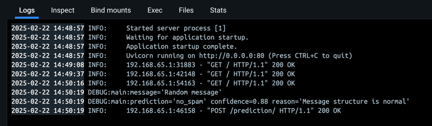

# FastAPI ML Prediction API 
FastAPI based on REST API for ML inference

## Запуск с Docker
```bash
docker build -t fastapi_ml .
```

```bash
docker-compose up --build -d
```

## Использованиe API  
#### GET /
```http
GET http://127.0.0.1:8000/
Content-Type: application/json
```

#### Ответ
```
{
  "Description": "This is ML prediction.\nSend a dict in the following format {'message':'Your message'} to predict if this spam or not"
}
```

### Предсказание спама
#### POST /prediction/
```http
POST http://127.0.0.1:8000/prediction/
Content-Type: application/json

{
  "message": "Random message"
}
```

#### Пример ответа
```
{
  "prediction": "spam",
  "confidence": 0.95,
  "reason": "Contains 'win' and 'prize'"
}
```


